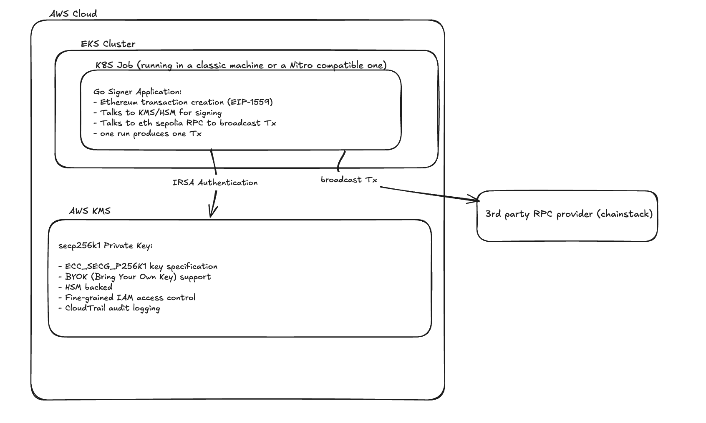

# Architecture Documentation

## Overview

This project demonstrates a secure Ethereum transaction signer using AWS KMS keys deployed on Amazon EKS. The solution showcases cloud-native security practices, Infrastructure as Code (IaC), and advanced deployment patterns including Nitro Enclaves integration (work in progress).

## 🏗️ System Architecture



## 🔧 Technology Stack

### Infrastructure Layer
- **AWS VPC**: Multi-AZ networking with private subnets
- **Amazon EKS**: Managed Kubernetes service (v1.29)
- **AWS KMS**: Hardware Security Module (HSM) backed key management
- **Terraform**: Infrastructure as Code with modular design
- **SOPS/age**: Secret encryption and management

### Application Layer
- **Go**: High-performance application runtime
- **go-ethereum**: Official Ethereum client library
- **AWS SDK v2**: Modern AWS service integration
- **Docker**: Containerized application deployment

### Deployment Layer
- **Kustomize**: Kubernetes native configuration management
- **IRSA**: IAM Roles for Service Accounts (no static credentials)
- **Docker Hub**: Container image registry
- **GitHub Actions**: CI/CD pipeline (ready)

### Security Enhancements (Advanced)
- **AWS Nitro Enclaves**: Hardware-level isolation and attestation
- **Enclaver**: Simplified Nitro Enclaves deployment
- **PCR-based attestation**: Cryptographic proof of enclave integrity

## 🏛️ Infrastructure Design

### Multi-Stack Terraform Architecture

The infrastructure is organized into independent, composable stacks:

```
terraform/
├── stacks/
│   ├── vpc/        # Network foundation (independent)
│   ├── kms/        # Key management (independent)
│   ├── eks/        # Kubernetes cluster (depends on VPC)
│   └── irsa/       # Service account roles (depends on EKS + KMS)
├── modules/        # Reusable components
└── envs/           # Environment-specific variables
```

**Benefits:**

- **Separation of Concerns**: Each stack has a single responsibility
- **Independent State**: Separate Terraform state files prevent conflicts
- **Dependency Management**: Clear dependency chain via remote state
- **Scalability**: Easy to extend with additional stacks

### Network Security

```
VPC (10.0.0.0/16)
├── Public Subnets (10.0.101.0/24, 10.0.102.0/24, 10.0.103.0/24)
│   └── NAT Gateways for outbound traffic
└── Private Subnets (10.0.1.0/24, 10.0.2.0/24, 10.0.3.0/24)
    └── EKS worker nodes (no direct internet access)
```

## 🔐 Security Model

### Identity and Access Management

1. **IRSA (IAM Roles for Service Accounts)**
   - No static AWS credentials in pods
   - Fine-grained permissions per service account
   - Automatic credential rotation
   - Kubernetes-native identity federation

2. **KMS Key Policy**
   ```json
   {
     "Effect": "Allow",
     "Principal": {"AWS": "arn:aws:iam::ACCOUNT:role/irsa-role"},
     "Action": ["kms:Sign", "kms:GetPublicKey", "kms:DescribeKey"],
     "Resource": "*"
   }
   ```

3. **Least Privilege Access**
   - Service account can only sign with specific KMS key
   - No decrypt, encrypt, or key management permissions
   - Scoped to single namespace

### Secret Management

- **SOPS Encryption**: All secrets encrypted at rest using age keys
- **Runtime Decryption**: Secrets decrypted only during deployment
- **No Plain Text**: Encrypted secrets committed to Git
- **Key Rotation**: Age keys can be rotated independently

### Audit and Compliance

- **CloudTrail Integration**: All KMS operations logged
- **EKS Control Plane Logs**: API, audit, authenticator logs enabled
- **VPC Flow Logs**: Network traffic monitoring
- **Container Security**: Distroless base images, non-root execution

## 🚀 Deployment Architecture

### Job-Based Execution Model

The application uses Kubernetes Jobs rather than long-running deployments:

**Benefits:**

- **Reduced Attack Surface**: No persistent API endpoints
- **Resource Efficiency**: Pods created only when needed
- **Audit Trail**: Each transaction creates a distinct job
- **Failure Isolation**: Failed jobs don't affect future transactions

### Container Security

```dockerfile
FROM golang:1.22-alpine AS builder
# ... build process ...
FROM gcr.io/distroless/base-debian12
USER nonroot:nonroot
ENTRYPOINT ["/bin/transfer"]
```

- **Distroless Images**: Minimal attack surface
- **Non-root Execution**: Reduced privilege escalation risk
- **Multi-stage Builds**: Smaller final images

## 🔒 Advanced Security: Nitro Enclaves

### Hardware-Level Attestation

**⚠️ Work in Progress**: The Nitro Enclaves integration is currently not functional. When fully implemented, the system would provide:

1. **Cryptographic Attestation**: Proof of enclave integrity via PCR measurements
2. **Memory Encryption**: Hardware-level isolation from host OS
3. **Tamper Evidence**: Any modification invalidates attestation
4. **Zero-Trust Access**: KMS keys only accessible with valid attestation (PCR0-based policies)


---

## Note: AI-Assisted Development

Fpr full transparency: This architecture documentation and some parts of the project itself were developed with assistance from AI tools:

- **Cursor IDE with Claude 4 Sonnet MAX**: Used for system design, debugging Infrastructure as Code, and comprehensive documentation
- **GPT-5**: Additional assistance for searching in AWS & Enclaver documentation

---
